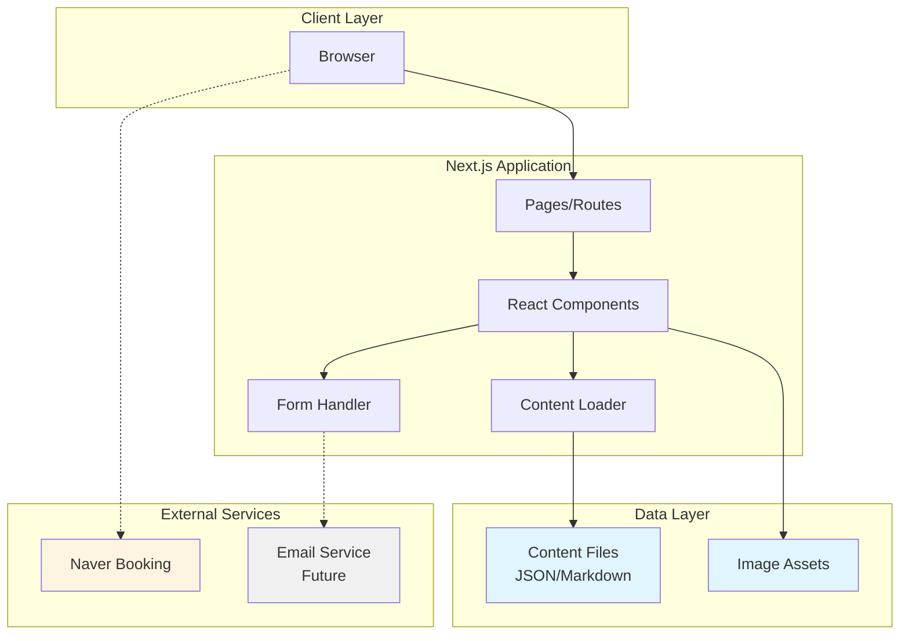
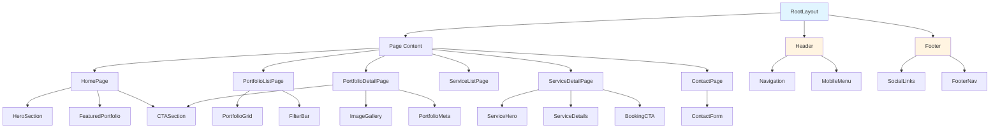

# Design Document: Photography Portfolio Site

## Overview

### Purpose

This design document specifies the technical architecture for a photography portfolio website built with Next.js. The system serves as a brand showcase and conversion tool, guiding visitors from portfolio browsing to booking consultations via external Naver Booking integration.

### Scope

The system includes:
- Static portfolio and service showcase pages
- Contact inquiry form with server-side handling
- Local file-based content management
- SEO optimization and performance tuning
- Mobile-first responsive design
- Vercel deployment configuration

The system explicitly excludes:
- E-commerce functionality (cart, checkout, payments)
- Custom booking/reservation system
- User authentication and membership
- Inventory management
- Order processing

### Key Design Principles

1. **MVP-First**: Deliver core functionality quickly; avoid over-engineering
2. **Static-First**: Pre-render all content at build time for maximum performance
3. **Mobile-First**: Optimize for mobile experience as primary use case
4. **Content-Driven**: Design for easy content updates and future CMS migration
5. **Conversion-Focused**: Guide visitors toward booking and inquiry actions
6. **Performance-Obsessed**: Target sub-2.5s LCP and minimal layout shift

### Technology Stack

- **Framework**: Next.js 14+ (App Router)
- **Language**: TypeScript
- **Styling**: Tailwind CSS
- **Image Optimization**: Next.js Image component
- **Content**: Local JSON/Markdown files
- **Form Handling**: Next.js Route Handler or Server Action
- **Deployment**: Vercel
- **Analytics**: GA4 or Vercel Analytics (future)

---

## Architecture

### System Architecture



### Rendering Strategy

**Decision**: Static Site Generation (SSG) with Incremental Static Regeneration (ISR) fallback

**Rationale**:
- Portfolio content changes infrequently (weekly/monthly)
- SEO requires fully rendered HTML at request time
- Performance demands instant page loads
- Vercel deployment optimizes for static content delivery

**Implementation**:
- All pages pre-rendered at build time using `generateStaticParams`
- Content sourced from local files during build
- Redeployment triggers full rebuild (acceptable for MVP)
- Future: ISR with revalidation for CMS integration

### Information Architecture

```
/                           # Home (hero, featured work, CTAs)
├── /about                  # Brand story, photographer bio
├── /portfolio              # Portfolio list (filterable)
│   └── /portfolio/[slug]   # Portfolio item detail
├── /services               # Services list
│   └── /services/[slug]    # Service detail (with booking CTA)
├── /contact                # Contact form
├── /faq                    # FAQ section
└── /404                    # Error page
```

### Routing Strategy

**App Router Structure**:
```
app/
├── layout.tsx              # Root layout (header, footer)
├── page.tsx                # Home page
├── about/
│   └── page.tsx
├── portfolio/
│   ├── page.tsx            # Portfolio list
│   └── [slug]/
│       └── page.tsx        # Portfolio detail (SSG)
├── services/
│   ├── page.tsx            # Services list
│   └── [slug]/
│       └── page.tsx        # Service detail (SSG)
├── contact/
│   └── page.tsx
├── faq/
│   └── page.tsx
├── api/
│   └── contact/
│       └── route.ts        # Contact form handler
└── not-found.tsx           # 404 page
```

**Dynamic Route Generation**:
- `generateStaticParams` in `portfolio/[slug]/page.tsx` reads content files
- `generateStaticParams` in `services/[slug]/page.tsx` reads content files
- Build fails if content validation fails

### Component Architecture

**Component Hierarchy**:



**Component Categories**:

1. **Layout Components** (shared across pages)
   - `Header`: Site-wide navigation
   - `Footer`: Social links, secondary nav
   - `MobileMenu`: Hamburger menu for mobile
   - `Breadcrumbs`: Navigation context on detail pages

2. **Content Components** (display content)
   - `HeroSection`: Large image + headline + CTA
   - `PortfolioGrid`: Grid of portfolio items
   - `PortfolioCard`: Single portfolio item preview
   - `ImageGallery`: Full-screen image viewer
   - `ServiceCard`: Service preview card
   - `ServiceDetails`: Service description and pricing

3. **Interactive Components** (user actions)
   - `ContactForm`: Form with validation
   - `FilterBar`: Category filter for portfolio
   - `CTAButton`: Conversion-focused button
   - `BookingCTA`: Naver Booking link button

4. **Utility Components** (reusable primitives)
   - `OptimizedImage`: Wrapper for Next.js Image
   - `Container`: Max-width content wrapper
   - `Section`: Vertical spacing wrapper
   - `ErrorBoundary`: Error handling wrapper

---

## Components and Interfaces

### Core Component Specifications

#### Header Component

```typescript
// components/layout/header.tsx
interface HeaderProps {
  currentPath?: string;
}

export function Header({ currentPath }: HeaderProps): JSX.Element
```

**Responsibilities**:
- Render site logo and navigation links
- Highlight active page based on currentPath
- Toggle mobile menu on small screens
- Provide keyboard navigation support

**Behavior**:
- Desktop: Horizontal nav bar with links
- Mobile: Hamburger icon → slide-out menu
- Sticky positioning on scroll (optional)

#### PortfolioGrid Component

```typescript
// components/portfolio/portfolio-grid.tsx
interface PortfolioGridProps {
  items: PortfolioItem[];
  selectedCategory?: string;
}

export function PortfolioGrid({ items, selectedCategory }: PortfolioGridProps): JSX.Element
```

**Responsibilities**:
- Display portfolio items in responsive grid
- Filter items by category if selectedCategory provided
- Render PortfolioCard for each item
- Handle empty state when no items match filter

**Behavior**:
- Grid: 1 column (mobile), 2 columns (tablet), 3 columns (desktop)
- Lazy load images below fold
- Animate on scroll (optional)

#### ContactForm Component

```typescript
// components/contact/contact-form.tsx
interface ContactFormProps {
  onSuccess?: () => void;
  onError?: (error: Error) => void;
}

export function ContactForm({ onSuccess, onError }: ContactFormProps): JSX.Element
```

**Responsibilities**:
- Render form fields (name, email, phone, message)
- Validate inputs client-side
- Submit to `/api/contact` endpoint
- Display loading, success, and error states
- Preserve form data on error

**Behavior**:
- Client-side validation before submit
- Disable submit button during submission
- Show success message on completion
- Show error message and preserve data on failure

#### ImageGallery Component

```typescript
// components/portfolio/image-gallery.tsx
interface ImageGalleryProps {
  images: ImageAsset[];
  alt: string;
}

export function ImageGallery({ images, alt }: ImageGalleryProps): JSX.Element
```

**Responsibilities**:
- Display multiple images in gallery format
- Support lightbox/modal view (optional for MVP)
- Optimize image loading with Next.js Image
- Provide keyboard navigation

**Behavior**:
- Grid layout with click to expand
- Lazy load images
- Swipe gestures on mobile (optional)

### API Route Specifications

#### Contact Form Handler

```typescript
// app/api/contact/route.ts
interface ContactFormData {
  name: string;
  email: string;
  phone: string;
  message: string;
}

export async function POST(request: Request): Promise<Response>
```

**Responsibilities**:
- Validate incoming form data
- Sanitize inputs to prevent injection
- Send email notification (future) or log to service
- Return success/error response

**Behavior**:
- Validate required fields
- Return 400 for validation errors
- Return 500 for server errors
- Return 200 with success message

**MVP Implementation**:
- Log to console (development)
- Future: Integrate email service (SendGrid, Resend, etc.)

---

## Data Models

### Content File Schema

#### PortfolioItem Schema

```typescript
// types/content.ts
interface PortfolioItem {
  slug: string;              // URL-friendly identifier
  title: string;             // Display title
  description: string;       // Full description (supports markdown)
  category: string;          // Category for filtering (e.g., "wedding", "portrait")
  thumbnail: string;         // Path to thumbnail image
  images: string[];          // Array of image paths for gallery
  featured: boolean;         // Show on home page
  date: string;              // ISO date string (for sorting)
  seo: {
    title: string;           // SEO title (defaults to title)
    description: string;     // Meta description
    ogImage?: string;        // Open Graph image path
  };
}
```

**File Location**: `content/portfolio/*.json` or `content/portfolio/*.md`

**Example JSON**:
```json
{
  "slug": "spring-wedding-seoul",
  "title": "Spring Wedding in Seoul",
  "description": "A beautiful spring wedding...",
  "category": "wedding",
  "thumbnail": "/images/portfolio/spring-wedding/thumb.jpg",
  "images": [
    "/images/portfolio/spring-wedding/01.jpg",
    "/images/portfolio/spring-wedding/02.jpg"
  ],
  "featured": true,
  "date": "2024-03-15",
  "seo": {
    "title": "Spring Wedding Photography - Seoul",
    "description": "Professional wedding photography...",
    "ogImage": "/images/portfolio/spring-wedding/og.jpg"
  }
}
```

#### ShootService Schema

```typescript
interface ShootService {
  slug: string;              // URL-friendly identifier
  title: string;             // Service name
  description: string;       // Full description (supports markdown)
  shortDescription: string;  // Brief summary for list view
  pricing: string;           // Pricing information (text, not structured)
  duration: string;          // Typical duration (e.g., "2-3 hours")
  deliverables: string[];    // What client receives
  images: string[];          // Sample images
  bookingUrl: string;        // Naver Booking URL
  featured: boolean;         // Show on home page
  order: number;             // Display order
  seo: {
    title: string;
    description: string;
    ogImage?: string;
  };
}
```

**File Location**: `content/services/*.json`

#### SiteConfig Schema

```typescript
interface SiteConfig {
  site: {
    title: string;           // Site title
    description: string;     // Site description
    url: string;             // Production URL
    locale: string;          // Language locale (e.g., "ko-KR")
  };
  brand: {
    name: string;            // Brand/photographer name
    tagline: string;         // Brand tagline
    bio: string;             // Short bio for about page
    email: string;           // Contact email
    phone: string;           // Contact phone
  };
  social: {
    instagram?: string;      // Instagram URL
    facebook?: string;       // Facebook URL
    youtube?: string;        // YouTube URL
  };
  navigation: {
    header: NavItem[];       // Header nav items
    footer: NavItem[];       // Footer nav items
  };
  analytics: {
    gaId?: string;           // Google Analytics ID (future)
    vercelAnalytics: boolean; // Enable Vercel Analytics
  };
}

interface NavItem {
  label: string;
  href: string;
  external?: boolean;
}
```

**File Location**: `content/config.json`

### Content Loader Interface

```typescript
// lib/content.ts

/**
 * Load all portfolio items from content files
 */
export async function getPortfolioItems(): Promise<PortfolioItem[]>

/**
 * Load single portfolio item by slug
 */
export async function getPortfolioItem(slug: string): Promise<PortfolioItem | null>

/**
 * Load all shoot services from content files
 */
export async function getShootServices(): Promise<ShootService[]>

/**
 * Load single shoot service by slug
 */
export async function getShootService(slug: string): Promise<ShootService | null>

/**
 * Load site configuration
 */
export async function getSiteConfig(): Promise<SiteConfig>

/**
 * Get unique categories from portfolio items
 */
export async function getPortfolioCategories(): Promise<string[]>

/**
 * Validate content file against schema
 * Throws error if validation fails
 */
export function validateContent<T>(data: unknown, schema: Schema): T
```

### File System Structure

```
project-root/
├── content/
│   ├── config.json
│   ├── portfolio/
│   │   ├── spring-wedding-seoul.json
│   │   ├── corporate-headshots.json
│   │   └── ...
│   └── services/
│       ├── wedding-photography.json
│       ├── portrait-session.json
│       └── ...
├── public/
│   └── images/
│       ├── portfolio/
│       │   ├── spring-wedding/
│       │   │   ├── thumb.jpg
│       │   │   ├── 01.jpg
│       │   │   └── ...
│       │   └── ...
│       └── services/
│           └── ...
└── app/
    └── ...
```

### Content Validation Strategy

**Build-Time Validation**:
- Use Zod or similar schema validation library
- Validate all content files during `getPortfolioItems()` and `getShootServices()`
- Fail build if any content file is invalid
- Provide clear error messages with file path and validation error

**Validation Rules**:
- Required fields must be present and non-empty
- Image paths must reference existing files in `public/`
- Slugs must be unique within their content type
- Dates must be valid ISO strings
- URLs must be valid format

---

## Correctness Properties

*A property is a characteristic or behavior that should hold true across all valid executions of a system—essentially, a formal statement about what the system should do. Properties serve as the bridge between human-readable specifications and machine-verifiable correctness guarantees.*

### Property 1: Portfolio item navigation

*For any* portfolio item in the system, clicking on it should navigate to its corresponding detail page with the correct slug in the URL.

**Validates: Requirements 1.2**

### Property 2: Portfolio item display completeness

*For any* portfolio item rendered in the list view, the rendered output must include the title, thumbnail image, and category.

**Validates: Requirements 1.3**

### Property 3: Portfolio detail page content

*For any* portfolio item detail page, the page must display the full image gallery and description from the content file.

**Validates: Requirements 1.4**

### Property 4: Service navigation

*For any* shoot service in the system, clicking on it should navigate to its corresponding detail page with the correct slug in the URL.

**Validates: Requirements 2.2**

### Property 5: Service detail page content

*For any* service detail page, the page must display service name, description, sample images, and pricing information.

**Validates: Requirements 2.3**

### Property 6: Booking CTA presence on services

*For any* service detail page, a Naver Booking link CTA must be present and contain the correct booking URL from the content file.

**Validates: Requirements 2.4, 21.1**

### Property 7: External link behavior

*For any* external link (Naver Booking, social media), clicking the link should open the target URL in a new tab with appropriate security attributes (rel="noopener noreferrer").

**Validates: Requirements 2.5, 15.3**

### Property 8: Contact form validation

*For any* contact form submission with missing or invalid required fields (name, email, phone, message), the form should prevent submission and display appropriate validation errors.

**Validates: Requirements 3.3**

### Property 9: Contact form submission success

*For any* valid contact form submission, the form should send data to the server endpoint and display a confirmation message on success.

**Validates: Requirements 3.4, 3.5**

### Property 10: Contact form error handling

*For any* failed contact form submission, the form should display an error message and preserve the user's input data.

**Validates: Requirements 3.6**

### Property 11: Responsive layout adaptation

*For any* page in the system, the layout should adapt appropriately to mobile, tablet, and desktop viewport sizes without horizontal scrolling.

**Validates: Requirements 5.1**

### Property 12: Touch target sizing

*For any* interactive element (button, link, form input), the element should have a minimum touch target size of 44x44 pixels.

**Validates: Requirements 5.3**

### Property 13: Unique SEO metadata

*For any* page in the system, the page should have unique SEO metadata including title, description, and Open Graph tags that differ from other pages.

**Validates: Requirements 6.1**

### Property 14: Semantic HTML structure

*For any* page in the system, the HTML should use semantic elements (header, nav, main, article, footer) and maintain proper heading hierarchy (h1 → h2 → h3 without skipping levels).

**Validates: Requirements 6.2**

### Property 15: Structured data presence

*For any* portfolio item or service detail page, the page should include valid JSON-LD structured data markup.

**Validates: Requirements 6.5**

### Property 16: Image alt text

*For any* image rendered in the system, the image must have descriptive alt text that is non-empty and meaningful.

**Validates: Requirements 6.6, 12.4**

### Property 17: Descriptive URL slugs

*For any* portfolio item or service, the URL slug should be derived from the title and be human-readable (lowercase, hyphen-separated).

**Validates: Requirements 6.7**

### Property 18: Content validation at build

*For any* content file in the system, the file must pass schema validation during build, or the build should fail with a descriptive error message indicating the file path and validation failure.

**Validates: Requirements 7.5, 22.1, 22.2**

### Property 19: Required field validation

*For any* portfolio item or service content file, all required fields (title, slug, images/description for portfolio; title, slug, description, bookingUrl for services) must be present and non-empty, or validation should fail.

**Validates: Requirements 22.3, 22.4**

### Property 20: Image path validation

*For any* image path referenced in a content file, the corresponding file must exist in the public directory, or validation should fail.

**Validates: Requirements 22.5**

### Property 21: Next.js Image component usage

*For any* image rendered in the system, the image should be rendered using the Next.js Image component with appropriate responsive sizes and lazy loading for below-the-fold images.

**Validates: Requirements 8.1, 8.2, 8.3, 8.4**

### Property 22: Layout component presence

*For any* page in the system, the page should include the header navigation component and footer component.

**Validates: Requirements 9.1, 9.3**

### Property 23: Active navigation highlighting

*For any* page in the system, the navigation menu should highlight the current page's corresponding navigation item.

**Validates: Requirements 9.5**

### Property 24: Breadcrumb navigation on detail pages

*For any* portfolio or service detail page, breadcrumb navigation should be present showing the path from home to the current page.

**Validates: Requirements 9.6**

### Property 25: 404 error handling

*For any* non-existent URL path, the system should display a 404 error page with navigation links back to main sections.

**Validates: Requirements 10.1**

### Property 26: Content loading error handling

*For any* content loading failure, the system should display a user-friendly error message instead of crashing or showing raw error details.

**Validates: Requirements 10.4**

### Property 27: Error logging

*For any* error that occurs in the system, the error should be logged with sufficient context for debugging (error message, stack trace, user action).

**Validates: Requirements 10.5**

### Property 28: Analytics event tracking

*For any* tracked user action (page view, link click, form submission, CTA click), an analytics event should be fired with consistent naming convention following the pattern: `{category}_{action}` (e.g., `portfolio_view`, `booking_click`).

**Validates: Requirements 11.1, 11.2, 11.3, 11.4, 11.5, 11.6, 11.7**

### Property 29: Keyboard navigation support

*For any* interactive element in the system, the element should be keyboard accessible (focusable and operable via keyboard) and display a visible focus indicator.

**Validates: Requirements 12.2, 12.7**

### Property 30: Color contrast compliance

*For any* text element in the system, the text should maintain a minimum color contrast ratio of 4.5:1 against its background.

**Validates: Requirements 12.3**

### Property 31: Semantic link and button distinction

*For any* interactive element, links (navigation to different pages) should use `<a>` tags and buttons (triggering actions) should use `<button>` tags.

**Validates: Requirements 12.5**

### Property 32: Form label association

*For any* form input in the contact form, the input should have an associated label element properly linked via `htmlFor` attribute.

**Validates: Requirements 12.6**

### Property 33: Static generation of dynamic routes

*For any* portfolio item or service in the content files, a corresponding static page should be generated at build time using `generateStaticParams`.

**Validates: Requirements 13.2, 13.3**

### Property 34: Booking guidance on service pages

*For any* service detail page, booking guidance or instructions should be displayed to help visitors understand the booking process.

**Validates: Requirements 14.4**

### Property 35: Font optimization

*For any* web font used in the system, the font should be loaded using Next.js font optimization with appropriate font-display strategy (swap or optional).

**Validates: Requirements 19.1, 19.3**

### Property 36: Portfolio filtering functionality

*For any* category filter selection on the portfolio page, the displayed portfolio items should update to show only items matching the selected category without page reload, and the filter state should be reflected in the URL query parameters.

**Validates: Requirements 20.1, 20.2, 20.4**

### Property 37: Category display on portfolio items

*For any* portfolio item displayed in the system, the category information should be visible to users.

**Validates: Requirements 20.3**

### Property 38: Inquiry CTA on portfolio pages

*For any* portfolio item detail page, an inquiry CTA should be present to encourage visitors to contact about the work.

**Validates: Requirements 21.2**

### Property 39: Consistent CTA styling

*For any* CTA element in the system, the styling and language should follow consistent patterns (same button styles, similar action-oriented text).

**Validates: Requirements 21.4**

---

## Error Handling

### Error Categories

1. **Content Errors** (Build-time)
   - Invalid content file schema
   - Missing required fields
   - Invalid image paths
   - Duplicate slugs

2. **Runtime Errors** (Client-side)
   - Form validation failures
   - Network request failures
   - Image loading failures
   - Navigation errors

3. **Server Errors** (Server-side)
   - API route failures
   - Email service failures (future)
   - Database connection failures (future)

### Error Handling Strategy

#### Build-Time Error Handling

```typescript
// lib/content.ts
export async function getPortfolioItems(): Promise<PortfolioItem[]> {
  try {
    const files = await fs.readdir('content/portfolio');
    const items: PortfolioItem[] = [];
    
    for (const file of files) {
      const content = await fs.readFile(`content/portfolio/${file}`, 'utf-8');
      const data = JSON.parse(content);
      
      // Validate against schema
      const validated = validateContent<PortfolioItem>(data, portfolioItemSchema);
      
      // Validate image paths exist
      for (const imagePath of validated.images) {
        if (!await fileExists(`public${imagePath}`)) {
          throw new Error(
            `Image not found: ${imagePath} referenced in ${file}`
          );
        }
      }
      
      items.push(validated);
    }
    
    // Check for duplicate slugs
    const slugs = items.map(item => item.slug);
    const duplicates = slugs.filter((slug, index) => slugs.indexOf(slug) !== index);
    if (duplicates.length > 0) {
      throw new Error(`Duplicate slugs found: ${duplicates.join(', ')}`);
    }
    
    return items;
  } catch (error) {
    console.error('Failed to load portfolio items:', error);
    throw error; // Fail the build
  }
}
```

#### Client-Side Error Handling

```typescript
// components/contact/contact-form.tsx
export function ContactForm() {
  const [state, setState] = useState<'idle' | 'loading' | 'success' | 'error'>('idle');
  const [formData, setFormData] = useState({ name: '', email: '', phone: '', message: '' });
  const [errors, setErrors] = useState<Record<string, string>>({});
  
  const handleSubmit = async (e: React.FormEvent) => {
    e.preventDefault();
    
    // Client-side validation
    const validationErrors = validateFormData(formData);
    if (Object.keys(validationErrors).length > 0) {
      setErrors(validationErrors);
      return;
    }
    
    setState('loading');
    
    try {
      const response = await fetch('/api/contact', {
        method: 'POST',
        headers: { 'Content-Type': 'application/json' },
        body: JSON.stringify(formData),
      });
      
      if (!response.ok) {
        throw new Error('Failed to submit form');
      }
      
      setState('success');
      setFormData({ name: '', email: '', phone: '', message: '' }); // Clear on success
    } catch (error) {
      console.error('Form submission error:', error);
      setState('error');
      // Preserve formData so user doesn't lose their input
    }
  };
  
  return (
    <form onSubmit={handleSubmit}>
      {/* Form fields */}
      {state === 'error' && (
        <div role="alert" className="error-message">
          Failed to submit form. Please try again.
        </div>
      )}
      {state === 'success' && (
        <div role="status" className="success-message">
          Thank you! We'll get back to you soon.
        </div>
      )}
    </form>
  );
}
```

#### Server-Side Error Handling

```typescript
// app/api/contact/route.ts
export async function POST(request: Request) {
  try {
    const body = await request.json();
    
    // Server-side validation
    const validated = validateContactFormData(body);
    
    // Log the inquiry (MVP: console, Future: email service)
    console.log('Contact inquiry received:', validated);
    
    // Future: Send email
    // await sendEmail(validated);
    
    return Response.json({ success: true }, { status: 200 });
  } catch (error) {
    console.error('Contact form error:', error);
    
    if (error instanceof ValidationError) {
      return Response.json(
        { error: 'Invalid form data', details: error.message },
        { status: 400 }
      );
    }
    
    return Response.json(
      { error: 'Internal server error' },
      { status: 500 }
    );
  }
}
```

### Error Logging Strategy

**MVP**: Console logging with structured format
```typescript
// lib/logger.ts
export function logError(error: Error, context: Record<string, any>) {
  console.error({
    timestamp: new Date().toISOString(),
    message: error.message,
    stack: error.stack,
    context,
  });
}
```

**Future**: Integration with error tracking service (Sentry, LogRocket)

---

## Testing Strategy

### Testing Approach

This project uses a dual testing approach combining unit tests and property-based tests:

- **Unit tests**: Verify specific examples, edge cases, and integration points
- **Property tests**: Verify universal properties across all inputs

Together, these provide comprehensive coverage where unit tests catch concrete bugs and property tests verify general correctness.

### Property-Based Testing

**Library**: `fast-check` (JavaScript/TypeScript property-based testing library)

**Configuration**:
- Minimum 100 iterations per property test
- Each test tagged with reference to design document property
- Tag format: `Feature: photography-portfolio-site, Property {number}: {property_text}`

**Example Property Test**:

```typescript
// __tests__/content.property.test.ts
import fc from 'fast-check';
import { validateContent, portfolioItemSchema } from '@/lib/content';

describe('Content Validation Properties', () => {
  // Feature: photography-portfolio-site, Property 18: Content validation at build
  it('should validate all portfolio items against schema', () => {
    fc.assert(
      fc.property(
        fc.record({
          slug: fc.string(),
          title: fc.string(),
          description: fc.string(),
          category: fc.string(),
          thumbnail: fc.string(),
          images: fc.array(fc.string()),
          featured: fc.boolean(),
          date: fc.date().map(d => d.toISOString()),
          seo: fc.record({
            title: fc.string(),
            description: fc.string(),
          }),
        }),
        (data) => {
          // Valid data should pass validation
          if (isValidPortfolioItem(data)) {
            expect(() => validateContent(data, portfolioItemSchema)).not.toThrow();
          } else {
            // Invalid data should fail validation
            expect(() => validateContent(data, portfolioItemSchema)).toThrow();
          }
        }
      ),
      { numRuns: 100 }
    );
  });
  
  // Feature: photography-portfolio-site, Property 19: Required field validation
  it('should reject portfolio items missing required fields', () => {
    fc.assert(
      fc.property(
        fc.record({
          slug: fc.option(fc.string(), { nil: undefined }),
          title: fc.option(fc.string(), { nil: undefined }),
          description: fc.option(fc.string(), { nil: undefined }),
          images: fc.option(fc.array(fc.string()), { nil: undefined }),
        }),
        (data) => {
          const hasAllRequired = data.slug && data.title && data.description && data.images;
          
          if (hasAllRequired) {
            // Should not throw if all required fields present
            expect(() => validateContent(data, portfolioItemSchema)).not.toThrow();
          } else {
            // Should throw if any required field missing
            expect(() => validateContent(data, portfolioItemSchema)).toThrow();
          }
        }
      ),
      { numRuns: 100 }
    );
  });
});
```

### Unit Testing

**Library**: Jest + React Testing Library

**Focus Areas**:
- Component rendering with specific props
- Form validation logic
- Content loading functions
- Error boundary behavior
- Navigation interactions

**Example Unit Test**:

```typescript
// __tests__/components/contact-form.test.tsx
import { render, screen, fireEvent, waitFor } from '@testing-library/react';
import { ContactForm } from '@/components/contact/contact-form';

describe('ContactForm', () => {
  it('should display validation errors for empty required fields', async () => {
    render(<ContactForm />);
    
    const submitButton = screen.getByRole('button', { name: /submit/i });
    fireEvent.click(submitButton);
    
    await waitFor(() => {
      expect(screen.getByText(/name is required/i)).toBeInTheDocument();
      expect(screen.getByText(/email is required/i)).toBeInTheDocument();
    });
  });
  
  it('should preserve form data on submission error', async () => {
    // Mock fetch to return error
    global.fetch = jest.fn(() =>
      Promise.resolve({
        ok: false,
        status: 500,
      } as Response)
    );
    
    render(<ContactForm />);
    
    const nameInput = screen.getByLabelText(/name/i);
    const emailInput = screen.getByLabelText(/email/i);
    
    fireEvent.change(nameInput, { target: { value: 'John Doe' } });
    fireEvent.change(emailInput, { target: { value: 'john@example.com' } });
    
    const submitButton = screen.getByRole('button', { name: /submit/i });
    fireEvent.click(submitButton);
    
    await waitFor(() => {
      expect(screen.getByText(/failed to submit/i)).toBeInTheDocument();
    });
    
    // Form data should be preserved
    expect(nameInput).toHaveValue('John Doe');
    expect(emailInput).toHaveValue('john@example.com');
  });
});
```

### Integration Testing

**Focus**: End-to-end user flows

**Tool**: Playwright (future, not MVP)

**Key Flows**:
1. Browse portfolio → View detail → Click inquiry CTA → Submit contact form
2. Browse services → View detail → Click booking CTA → External redirect
3. Mobile navigation → Hamburger menu → Navigate to page
4. Portfolio filtering → Select category → View filtered results

### Performance Testing

**Tools**:
- Lighthouse CI (automated performance audits)
- Vercel Analytics (real user monitoring)

**Metrics**:
- LCP < 2.5s
- FID < 100ms
- CLS < 0.1
- Time to Interactive < 3.5s

### Accessibility Testing

**Tools**:
- axe-core (automated accessibility testing)
- Manual keyboard navigation testing
- Screen reader testing (NVDA, VoiceOver)

**Checks**:
- Semantic HTML structure
- ARIA labels where needed
- Keyboard navigation
- Color contrast
- Focus indicators
- Alt text for images

---

## Recommended Architecture Summary

### System Overview

Photography portfolio website built with Next.js 14+, using static site generation for optimal performance and SEO. Content managed via local JSON files with clear migration path to headless CMS. External Naver Booking integration for reservations.

### Core Architecture Decisions

1. **Rendering**: Static Site Generation (SSG) for all pages
2. **Content**: Local JSON files → Future CMS migration
3. **Booking**: External Naver Booking link integration
4. **Styling**: Tailwind CSS for rapid development
5. **Deployment**: Vercel with automatic deployments
6. **Images**: Next.js Image component with optimization

### Technology Stack

```
Frontend:
- Next.js 14+ (App Router, React Server Components)
- TypeScript (strict mode)
- Tailwind CSS
- React 18+

Content:
- Local JSON files
- Zod validation
- File-based routing

Deployment:
- Vercel (edge network)
- GitHub integration
- Automatic preview deployments

Future:
- Headless CMS (Sanity recommended)
- Email service (Resend recommended)
- GA4 or Vercel Analytics
```

### Project Structure

```
photography-portfolio-site/
├── app/                          # Next.js app directory
│   ├── layout.tsx                # Root layout
│   ├── page.tsx                  # Home page
│   ├── about/page.tsx            # About page
│   ├── portfolio/
│   │   ├── page.tsx              # Portfolio list
│   │   └── [slug]/page.tsx       # Portfolio detail
│   ├── services/
│   │   ├── page.tsx              # Services list
│   │   └── [slug]/page.tsx       # Service detail
│   ├── contact/page.tsx          # Contact page
│   ├── faq/page.tsx              # FAQ page
│   ├── api/
│   │   └── contact/route.ts      # Contact form handler
│   ├── sitemap.ts                # Sitemap generation
│   ├── robots.ts                 # Robots.txt
│   └── not-found.tsx             # 404 page
├── components/
│   ├── layout/                   # Layout components
│   ├── portfolio/                # Portfolio components
│   ├── services/                 # Service components
│   ├── contact/                  # Contact components
│   ├── home/                     # Home page components
│   ├── shared/                   # Shared components
│   └── ui/                       # UI primitives
├── content/
│   ├── config.json               # Site configuration
│   ├── portfolio/*.json          # Portfolio items
│   └── services/*.json           # Services
├── lib/
│   ├── content.ts                # Content loaders
│   ├── validation.ts             # Zod schemas
│   └── utils.ts                  # Utility functions
├── public/
│   └── images/                   # Image assets
├── types/
│   └── content.ts                # TypeScript types
└── __tests__/                    # Test files
```

### Key Design Patterns

1. **Server Components First**: Use React Server Components by default, Client Components only when needed
2. **Composition Over Configuration**: Compose small components rather than large configurable ones
3. **Type Safety**: TypeScript interfaces + Zod validation for all content
4. **Progressive Enhancement**: Core functionality works without JavaScript
5. **Mobile First**: Design and optimize for mobile, enhance for desktop

### Performance Strategy

- Static generation for instant page loads
- Next.js Image component for automatic optimization
- Lazy loading for below-the-fold images
- Font optimization with next/font
- Minimal JavaScript bundle (< 200KB)
- Target LCP < 2.5s, CLS < 0.1

### SEO Strategy

- Unique metadata for every page
- Semantic HTML structure
- Structured data (JSON-LD)
- Sitemap and robots.txt
- Descriptive URLs and alt text
- Mobile-friendly design

### Accessibility Strategy

- WCAG 2.1 Level AA compliance
- Semantic HTML elements
- Keyboard navigation support
- Screen reader compatibility
- Color contrast 4.5:1 minimum
- Focus indicators visible

---

## Codex Handoff Summary

### Implementation Guide for AI Agents

This section provides clear guidance for Codex or other AI agents implementing this design.

### Project Initialization

```bash
# Create Next.js project
npx create-next-app@latest photography-portfolio-site --typescript --tailwind --app --no-src-dir

# Install dependencies
cd photography-portfolio-site
npm install zod

# Initialize git
git init
git add .
git commit -m "Initial commit"
```

### Implementation Order (Critical)

Follow this exact order to avoid dependency issues:

1. **Foundation** (Do First):
   - Create TypeScript interfaces in `types/content.ts`
   - Create Zod schemas in `lib/validation.ts`
   - Create content loader functions in `lib/content.ts`
   - Create sample content files in `content/`

2. **Layout** (Do Second):
   - Create root layout in `app/layout.tsx`
   - Create Header component
   - Create Footer component
   - Create utility components (Container, Section)

3. **Pages** (Do Third):
   - Home page
   - Portfolio list and detail pages
   - Services list and detail pages
   - Contact page

4. **Interactive Features** (Do Fourth):
   - Contact form with API route
   - Portfolio filtering
   - Mobile menu

5. **SEO and Performance** (Do Fifth):
   - Metadata for all pages
   - Sitemap and robots.txt
   - Image optimization
   - Font optimization

6. **Polish** (Do Last):
   - Error pages
   - Analytics
   - Testing
   - Accessibility audit

### Critical Implementation Rules

#### MUST DO

1. **Always use TypeScript strict mode**
2. **Always validate content with Zod schemas**
3. **Always use Next.js Image component for images**
4. **Always use Server Components unless interactivity needed**
5. **Always add metadata to pages**
6. **Always test on mobile first**
7. **Always add alt text to images**
8. **Always use semantic HTML**

#### MUST NOT DO

1. **Never use img tags** (use Next.js Image)
2. **Never skip content validation**
3. **Never hardcode content** (use content files)
4. **Never use inline styles** (use Tailwind)
5. **Never skip TypeScript types**
6. **Never use any type** (use proper types)
7. **Never build custom booking system** (use Naver Booking link)
8. **Never add unnecessary dependencies**

### Common Pitfalls to Avoid

1. **Image Optimization**:
   - ❌ Using img tags
   - ✅ Using Next.js Image component with sizes

2. **Content Loading**:
   - ❌ Loading content in Client Components
   - ✅ Loading content in Server Components

3. **Form Handling**:
   - ❌ Using form libraries (unnecessary)
   - ✅ Using native form with validation

4. **State Management**:
   - ❌ Adding Redux/Zustand (unnecessary)
   - ✅ Using React state for local state only

5. **Styling**:
   - ❌ Adding CSS-in-JS libraries
   - ✅ Using Tailwind CSS exclusively

### First Implementation Scope (MVP)

**Week 1 (Days 1-7)**:
- Project setup
- Content infrastructure
- Layout components
- Home page
- Portfolio pages (list + detail)
- Services pages (list + detail)

**Week 2 (Days 8-14)**:
- Contact form with API route
- Portfolio filtering
- SEO implementation
- Image optimization
- Error pages
- Testing and polish
- Deployment

**Total MVP**: 14 days

### Code Examples for Key Features

#### Content Loader

```typescript
// lib/content.ts
import fs from 'fs/promises';
import path from 'path';
import { validatePortfolioItem } from './validation';

export async function getPortfolioItems(): Promise<PortfolioItem[]> {
  const dir = path.join(process.cwd(), 'content/portfolio');
  const files = await fs.readdir(dir);
  
  const items = await Promise.all(
    files
      .filter(f => f.endsWith('.json'))
      .map(async f => {
        const content = await fs.readFile(path.join(dir, f), 'utf-8');
        return validatePortfolioItem(JSON.parse(content));
      })
  );
  
  return items.sort((a, b) => 
    new Date(b.date).getTime() - new Date(a.date).getTime()
  );
}
```

#### Dynamic Page with Metadata

```typescript
// app/portfolio/[slug]/page.tsx
import { getPortfolioItem, getPortfolioItems } from '@/lib/content';
import { notFound } from 'next/navigation';
import type { Metadata } from 'next';

export async function generateStaticParams() {
  const items = await getPortfolioItems();
  return items.map(item => ({ slug: item.slug }));
}

export async function generateMetadata({ params }: Props): Promise<Metadata> {
  const item = await getPortfolioItem(params.slug);
  if (!item) return {};
  
  return {
    title: item.seo.title,
    description: item.seo.description,
    openGraph: {
      title: item.seo.title,
      description: item.seo.description,
      images: [item.seo.ogImage || item.thumbnail],
    },
  };
}

export default async function Page({ params }: Props) {
  const item = await getPortfolioItem(params.slug);
  if (!item) notFound();
  
  return (
    <div>
      <h1>{item.title}</h1>
      {/* Rest of page */}
    </div>
  );
}
```

#### Contact Form API Route

```typescript
// app/api/contact/route.ts
import { NextRequest, NextResponse } from 'next/server';
import { z } from 'zod';

const schema = z.object({
  name: z.string().min(2),
  email: z.string().email(),
  phone: z.string().min(5),
  message: z.string().min(10),
});

export async function POST(request: NextRequest) {
  try {
    const body = await request.json();
    const data = schema.parse(body);
    
    // Log inquiry (MVP)
    console.log('Contact inquiry:', data);
    
    // Future: Send email
    
    return NextResponse.json({ success: true });
  } catch (error) {
    if (error instanceof z.ZodError) {
      return NextResponse.json(
        { error: 'Invalid data', details: error.errors },
        { status: 400 }
      );
    }
    return NextResponse.json(
      { error: 'Internal error' },
      { status: 500 }
    );
  }
}
```

### Testing Strategy

```typescript
// __tests__/content.test.ts
import { getPortfolioItems } from '@/lib/content';

describe('Content Loading', () => {
  it('should load all portfolio items', async () => {
    const items = await getPortfolioItems();
    expect(items.length).toBeGreaterThan(0);
    expect(items[0]).toHaveProperty('slug');
    expect(items[0]).toHaveProperty('title');
  });
});

// __tests__/components/portfolio-card.test.tsx
import { render, screen } from '@testing-library/react';
import { PortfolioCard } from '@/components/portfolio/portfolio-card';

describe('PortfolioCard', () => {
  it('should render portfolio item', () => {
    const item = {
      slug: 'test',
      title: 'Test Item',
      category: 'wedding',
      thumbnail: '/images/test.jpg',
      // ... other fields
    };
    
    render(<PortfolioCard item={item} />);
    expect(screen.getByText('Test Item')).toBeInTheDocument();
  });
});
```

### Deployment Checklist

Before deploying to production:

- [ ] All content files validated
- [ ] All images optimized (< 200KB)
- [ ] All pages have metadata
- [ ] Sitemap generated
- [ ] Robots.txt configured
- [ ] Contact form tested
- [ ] Booking links verified
- [ ] Mobile responsive tested
- [ ] Lighthouse score > 90
- [ ] Accessibility audit passed
- [ ] No TypeScript errors
- [ ] No console errors
- [ ] Analytics configured
- [ ] Custom domain configured
- [ ] SSL certificate active

### Environment Variables

```bash
# .env.local
NEXT_PUBLIC_SITE_URL=https://janedoephotography.com

# Future additions:
# RESEND_API_KEY=re_xxxxx
# NEXT_PUBLIC_GA_ID=G-XXXXXXXXXX
```

### Vercel Configuration

```json
// vercel.json (optional)
{
  "buildCommand": "npm run build",
  "framework": "nextjs",
  "regions": ["icn1"]
}
```

---

## Execution Priority (MVP Launch)

### Priority 1 (Critical - Must Have)

1. **Project Setup** (Day 1)
   - Initialize Next.js with TypeScript and Tailwind
   - Set up folder structure
   - Configure git and Vercel

2. **Content Infrastructure** (Day 1-2)
   - TypeScript interfaces
   - Zod validation
   - Content loaders
   - Sample content files

3. **Layout Components** (Day 2)
   - Root layout
   - Header with navigation
   - Footer
   - Mobile menu

4. **Home Page** (Day 3)
   - Hero section
   - Featured portfolio
   - Services overview
   - Primary CTAs

5. **Portfolio Pages** (Day 4-5)
   - Portfolio list page
   - Portfolio detail page
   - Image gallery
   - Static generation

6. **Services Pages** (Day 5-6)
   - Services list page
   - Service detail page
   - Booking CTA
   - Static generation

7. **Contact Form** (Day 7)
   - Contact page
   - Form with validation
   - API route handler
   - Success/error states

8. **SEO Basics** (Day 8)
   - Metadata for all pages
   - Sitemap
   - Robots.txt
   - Alt text for images

9. **Image Optimization** (Day 9)
   - Next.js Image component
   - Responsive sizes
   - Lazy loading
   - Image compression

10. **Deployment** (Day 10)
    - Deploy to Vercel
    - Configure domain
    - Test live site

### Priority 2 (Important - Should Have)

1. **Portfolio Filtering** (Day 11)
   - Category filter
   - URL state management
   - Empty state

2. **Error Pages** (Day 11)
   - 404 page
   - Error boundaries

3. **Analytics** (Day 12)
   - Vercel Analytics
   - Event tracking
   - Booking click tracking

4. **Accessibility** (Day 12)
   - Keyboard navigation
   - Focus indicators
   - ARIA labels
   - Contrast check

5. **Testing** (Day 13)
   - Unit tests
   - Component tests
   - Manual testing

6. **FAQ Page** (Day 13)
   - FAQ content
   - FAQ page

7. **About Page** (Day 14)
   - About content
   - Brand story
   - Contact info

8. **Final Polish** (Day 14)
   - Copy review
   - Link checking
   - Performance audit
   - Final testing

### Priority 3 (Nice to Have - Can Wait)

1. **Advanced Analytics**
   - Google Analytics
   - Heatmaps
   - Session recording

2. **Email Integration**
   - Email service setup
   - Email notifications
   - Email templates

3. **Content Enhancements**
   - Testimonials
   - Blog section
   - Press mentions

4. **Advanced Features**
   - Social media feed
   - Newsletter signup
   - Live chat

### Priority 4 (Future - Post-MVP)

1. **CMS Migration**
   - Headless CMS setup
   - Content import
   - ISR implementation

2. **Multi-language**
   - i18n setup
   - Translations
   - Language switcher

3. **Custom Booking**
   - Booking system
   - Payment integration
   - Calendar management

4. **Client Portal**
   - Authentication
   - Photo galleries
   - Download system

---

## Final Notes

### Success Metrics

**Technical**:
- Lighthouse score > 90
- LCP < 2.5s
- CLS < 0.1
- Zero critical accessibility issues
- 100% TypeScript coverage

**Business**:
- Booking click rate > 5%
- Contact form conversion > 2%
- Bounce rate < 60%
- Mobile traffic > 60%
- Average session > 2 minutes

### Maintenance Plan

**Weekly**:
- Monitor analytics
- Check error logs
- Review performance

**Monthly**:
- Update dependencies
- Content updates
- Performance audit

**Quarterly**:
- Major updates
- SEO audit
- Accessibility audit
- User feedback review

### Support Resources

- [Next.js Documentation](https://nextjs.org/docs)
- [Tailwind CSS Documentation](https://tailwindcss.com/docs)
- [Vercel Documentation](https://vercel.com/docs)
- [Zod Documentation](https://zod.dev/)
- [Web.dev Performance](https://web.dev/performance/)
- [WCAG Guidelines](https://www.w3.org/WAI/WCAG21/quickref/)

---

**Document Version**: 1.0  
**Last Updated**: 2024-01-15  
**Status**: Ready for Implementation
