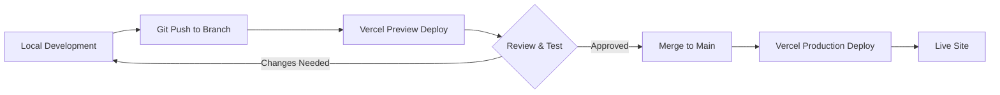

# Deployment and Operations

## Deployment Strategy

### Platform: Vercel

**Rationale**:
- Native Next.js support with zero configuration
- Automatic deployments on git push
- Preview deployments for pull requests
- Global edge network for performance
- Built-in analytics and monitoring
- Generous free tier for MVP

### Deployment Workflow



### Repository Structure

```
photography-portfolio-site/
├── .github/
│   └── workflows/
│       └── ci.yml              # CI checks (optional)
├── app/                        # Next.js app directory
├── components/                 # React components
├── content/                    # Content files (JSON)
├── lib/                        # Utility functions
├── public/                     # Static assets
│   └── images/                 # Image files
├── types/                      # TypeScript types
├── __tests__/                  # Test files
├── .env.local.example          # Environment variables template
├── .gitignore
├── next.config.js              # Next.js configuration
├── package.json
├── tailwind.config.js          # Tailwind configuration
├── tsconfig.json               # TypeScript configuration
└── README.md
```

---

## Vercel Configuration

### Project Setup

1. **Connect Repository**:
   - Link GitHub/GitLab repository to Vercel
   - Vercel auto-detects Next.js project

2. **Build Settings**:
   ```
   Framework Preset: Next.js
   Build Command: npm run build
   Output Directory: .next
   Install Command: npm install
   ```

3. **Environment Variables**:
   ```
   # MVP: Minimal environment variables
   NEXT_PUBLIC_SITE_URL=https://janedoephotography.com
   
   # Future: Email service
   # RESEND_API_KEY=re_xxxxx
   
   # Future: Analytics
   # NEXT_PUBLIC_GA_ID=G-XXXXXXXXXX
   ```

### Domain Configuration

1. **Add Custom Domain**:
   - Go to Vercel project settings → Domains
   - Add custom domain (e.g., janedoephotography.com)
   - Configure DNS records as instructed by Vercel

2. **DNS Records**:
   ```
   Type: A
   Name: @
   Value: 76.76.21.21
   
   Type: CNAME
   Name: www
   Value: cname.vercel-dns.com
   ```

3. **SSL Certificate**:
   - Automatically provisioned by Vercel
   - Auto-renewal handled by Vercel

### Deployment Configuration

```javascript
// vercel.json (optional, for advanced configuration)
{
  "buildCommand": "npm run build",
  "devCommand": "npm run dev",
  "installCommand": "npm install",
  "framework": "nextjs",
  "regions": ["icn1"],  // Seoul region for Korean audience
  "headers": [
    {
      "source": "/images/(.*)",
      "headers": [
        {
          "key": "Cache-Control",
          "value": "public, max-age=31536000, immutable"
        }
      ]
    }
  ]
}
```

---

## Build Process

### Build Steps

1. **Install Dependencies**:
   ```bash
   npm install
   ```

2. **Content Validation**:
   - Load all content files
   - Validate against schemas
   - Check image paths exist
   - Fail build if validation errors

3. **Static Generation**:
   - Generate static pages for all routes
   - Generate portfolio detail pages
   - Generate service detail pages
   - Generate sitemap.xml

4. **Optimization**:
   - Optimize images
   - Minify JavaScript/CSS
   - Generate font subsets
   - Create build manifest

### Build Scripts

```json
// package.json
{
  "scripts": {
    "dev": "next dev",
    "build": "next build",
    "start": "next start",
    "lint": "next lint",
    "type-check": "tsc --noEmit",
    "test": "jest",
    "test:watch": "jest --watch",
    "validate-content": "node scripts/validate-content.js"
  }
}
```

### Pre-Build Validation Script

```javascript
// scripts/validate-content.js
const fs = require('fs');
const path = require('path');
const { validatePortfolioItem, validateShootService } = require('../lib/validation');

async function validateContent() {
  console.log('Validating content files...');
  
  let hasErrors = false;
  
  // Validate portfolio items
  const portfolioDir = path.join(__dirname, '../content/portfolio');
  const portfolioFiles = fs.readdirSync(portfolioDir);
  
  for (const file of portfolioFiles) {
    if (!file.endsWith('.json')) continue;
    
    try {
      const content = fs.readFileSync(path.join(portfolioDir, file), 'utf-8');
      const data = JSON.parse(content);
      validatePortfolioItem(data);
      console.log(`✓ ${file}`);
    } catch (error) {
      console.error(`✗ ${file}: ${error.message}`);
      hasErrors = true;
    }
  }
  
  // Validate services
  const servicesDir = path.join(__dirname, '../content/services');
  const serviceFiles = fs.readdirSync(servicesDir);
  
  for (const file of serviceFiles) {
    if (!file.endsWith('.json')) continue;
    
    try {
      const content = fs.readFileSync(path.join(servicesDir, file), 'utf-8');
      const data = JSON.parse(content);
      validateShootService(data);
      console.log(`✓ ${file}`);
    } catch (error) {
      console.error(`✗ ${file}: ${error.message}`);
      hasErrors = true;
    }
  }
  
  if (hasErrors) {
    console.error('\nContent validation failed!');
    process.exit(1);
  }
  
  console.log('\nAll content files validated successfully!');
}

validateContent();
```

---

## Continuous Integration

### GitHub Actions (Optional)

```yaml
# .github/workflows/ci.yml
name: CI

on:
  pull_request:
    branches: [main]
  push:
    branches: [main]

jobs:
  lint-and-test:
    runs-on: ubuntu-latest
    
    steps:
      - uses: actions/checkout@v3
      
      - name: Setup Node.js
        uses: actions/setup-node@v3
        with:
          node-version: '18'
          cache: 'npm'
      
      - name: Install dependencies
        run: npm ci
      
      - name: Run linter
        run: npm run lint
      
      - name: Type check
        run: npm run type-check
      
      - name: Validate content
        run: npm run validate-content
      
      - name: Run tests
        run: npm test
      
      - name: Build
        run: npm run build
```

---

## Monitoring and Analytics

### Vercel Analytics

```typescript
// app/layout.tsx
import { Analytics } from '@vercel/analytics/react';

export default function RootLayout({ children }: { children: React.ReactNode }) {
  return (
    <html>
      <body>
        {children}
        <Analytics />
      </body>
    </html>
  );
}
```

**Metrics Tracked**:
- Page views
- Unique visitors
- Top pages
- Referrers
- Devices and browsers
- Core Web Vitals

### Google Analytics (Future)

```typescript
// app/layout.tsx
import Script from 'next/script';

export default function RootLayout({ children }: { children: React.ReactNode }) {
  const gaId = process.env.NEXT_PUBLIC_GA_ID;
  
  return (
    <html>
      <head>
        {gaId && (
          <>
            <Script
              src={`https://www.googletagmanager.com/gtag/js?id=${gaId}`}
              strategy="afterInteractive"
            />
            <Script id="google-analytics" strategy="afterInteractive">
              {`
                window.dataLayer = window.dataLayer || [];
                function gtag(){dataLayer.push(arguments);}
                gtag('js', new Date());
                gtag('config', '${gaId}');
              `}
            </Script>
          </>
        )}
      </head>
      <body>{children}</body>
    </html>
  );
}
```

### Error Tracking (Future)

**Recommended**: Sentry

```typescript
// sentry.client.config.ts
import * as Sentry from '@sentry/nextjs';

Sentry.init({
  dsn: process.env.NEXT_PUBLIC_SENTRY_DSN,
  tracesSampleRate: 1.0,
  environment: process.env.NODE_ENV,
});
```

---

## Performance Monitoring

### Lighthouse CI

```yaml
# .github/workflows/lighthouse.yml
name: Lighthouse CI

on:
  pull_request:
    branches: [main]

jobs:
  lighthouse:
    runs-on: ubuntu-latest
    
    steps:
      - uses: actions/checkout@v3
      
      - name: Run Lighthouse CI
        uses: treosh/lighthouse-ci-action@v9
        with:
          urls: |
            https://preview-url.vercel.app
            https://preview-url.vercel.app/portfolio
            https://preview-url.vercel.app/services
          uploadArtifacts: true
```

### Performance Budgets

```javascript
// lighthouserc.js
module.exports = {
  ci: {
    collect: {
      numberOfRuns: 3,
    },
    assert: {
      assertions: {
        'categories:performance': ['error', { minScore: 0.9 }],
        'categories:accessibility': ['error', { minScore: 0.9 }],
        'categories:seo': ['error', { minScore: 0.9 }],
        'first-contentful-paint': ['error', { maxNumericValue: 2000 }],
        'largest-contentful-paint': ['error', { maxNumericValue: 2500 }],
        'cumulative-layout-shift': ['error', { maxNumericValue: 0.1 }],
      },
    },
  },
};
```

---

## Backup and Recovery

### Content Backup

**Primary**: Git repository
- All content files version controlled
- Full history of changes
- Easy rollback to any previous version

**Secondary**: Vercel deployment snapshots
- Each deployment includes content snapshot
- Can redeploy previous versions

### Database Backup (Future)

If migrating to CMS with database:
- Automated daily backups
- Point-in-time recovery
- Backup retention: 30 days

---

## Maintenance

### Content Updates

1. **Edit content files** in `content/` directory
2. **Commit changes** to git
3. **Push to main branch**
4. **Automatic deployment** triggered
5. **Verify changes** on live site

### Dependency Updates

```bash
# Check for outdated packages
npm outdated

# Update dependencies
npm update

# Update Next.js
npm install next@latest react@latest react-dom@latest

# Test after updates
npm run build
npm test
```

### Security Updates

- Enable Dependabot alerts on GitHub
- Review and merge security PRs promptly
- Run `npm audit` regularly
- Keep Next.js and dependencies up to date

---

## Troubleshooting

### Build Failures

**Common Issues**:

1. **Content Validation Error**:
   ```
   Error: Image not found: /images/portfolio/missing.jpg
   ```
   **Solution**: Check image path in content file, ensure image exists in `public/`

2. **TypeScript Error**:
   ```
   Error: Type 'string' is not assignable to type 'number'
   ```
   **Solution**: Fix type errors, run `npm run type-check` locally

3. **Out of Memory**:
   ```
   Error: JavaScript heap out of memory
   ```
   **Solution**: Increase Node memory: `NODE_OPTIONS=--max-old-space-size=4096 npm run build`

### Deployment Issues

1. **Domain Not Resolving**:
   - Check DNS records are correct
   - Wait for DNS propagation (up to 48 hours)
   - Verify domain in Vercel settings

2. **SSL Certificate Error**:
   - Vercel auto-provisions SSL
   - May take a few minutes after domain setup
   - Contact Vercel support if persists

3. **Preview Deployment Not Working**:
   - Check GitHub integration is active
   - Verify branch protection rules
   - Check Vercel project settings

### Performance Issues

1. **Slow Page Load**:
   - Check image sizes (compress if > 200KB)
   - Review Lighthouse report
   - Check for large JavaScript bundles

2. **High CLS**:
   - Add explicit width/height to images
   - Preload critical fonts
   - Reserve space for dynamic content

---

## Rollback Procedure

### Rollback to Previous Deployment

1. Go to Vercel dashboard → Deployments
2. Find previous successful deployment
3. Click "..." menu → "Promote to Production"
4. Confirm promotion

### Rollback Content Changes

```bash
# View git history
git log --oneline

# Revert to previous commit
git revert <commit-hash>

# Push to trigger redeployment
git push origin main
```

---

## Scaling Considerations

### Current Architecture (MVP)

- Static site generation
- No database
- No server-side state
- Scales automatically with Vercel

### Future Scaling Needs

1. **High Traffic**:
   - Vercel handles automatically
   - Consider CDN for images (Cloudinary, Imgix)

2. **CMS Integration**:
   - Add Incremental Static Regeneration (ISR)
   - Consider caching layer (Redis)

3. **User Authentication**:
   - Add authentication provider (Auth0, Clerk)
   - Consider serverless database (Vercel Postgres, PlanetScale)

4. **Advanced Features**:
   - Consider edge functions for personalization
   - Add rate limiting for API routes
   - Implement request caching

---

## Cost Estimation

### Vercel (Free Tier)

- **Bandwidth**: 100GB/month
- **Build Minutes**: 6,000 minutes/month
- **Serverless Function Executions**: 100GB-hours/month
- **Estimated Cost**: $0/month for MVP

### Vercel (Pro Tier - If Needed)

- **Cost**: $20/month per member
- **Bandwidth**: 1TB/month
- **Build Minutes**: Unlimited
- **When to Upgrade**: > 100GB bandwidth or need team features

### Additional Services (Future)

- **Email Service** (Resend): $0-20/month
- **CMS** (Sanity): $0-99/month
- **Error Tracking** (Sentry): $0-26/month
- **Image CDN** (Cloudinary): $0-99/month

**Total Estimated Cost (MVP)**: $0/month
**Total Estimated Cost (Future)**: $40-244/month
