# User Flows

## Primary User Flows

### Flow 1: Portfolio Browse → Inquiry

**Goal**: Visitor views portfolio work and submits inquiry

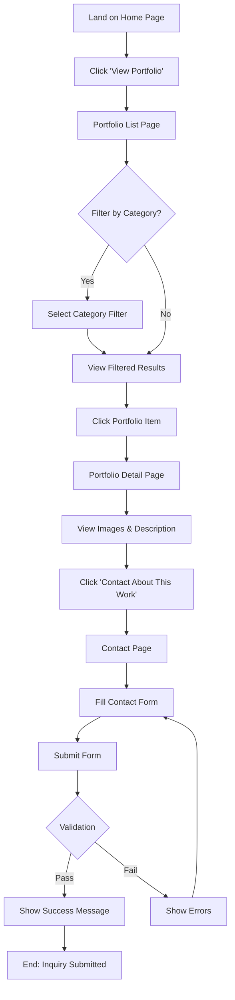

**Steps**:
1. Visitor lands on home page
2. Clicks "View Portfolio" CTA
3. Arrives at portfolio list page
4. (Optional) Filters by category
5. Clicks on portfolio item of interest
6. Views portfolio detail page with images and description
7. Clicks "Contact About This Work" CTA
8. Fills out contact form (name, email, phone, message)
9. Submits form
10. Sees success confirmation

**Success Criteria**:
- Form successfully submitted
- Visitor sees confirmation message
- Inquiry data captured for follow-up

### Flow 2: Service Browse → Booking

**Goal**: Visitor learns about service and books via Naver

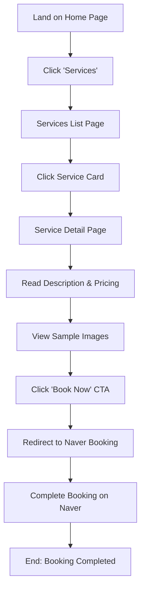

**Steps**:
1. Visitor lands on home page
2. Clicks "Services" in navigation or service CTA
3. Arrives at services list page
4. Clicks on service of interest
5. Views service detail page
6. Reads description, pricing, deliverables
7. Views sample images
8. Clicks "Book Now" CTA
9. Redirected to external Naver Booking page
10. Completes booking on Naver platform

**Success Criteria**:
- Visitor clicks booking CTA
- Successfully redirected to Naver Booking
- Analytics tracks booking click

### Flow 3: Direct Contact

**Goal**: Visitor submits general inquiry

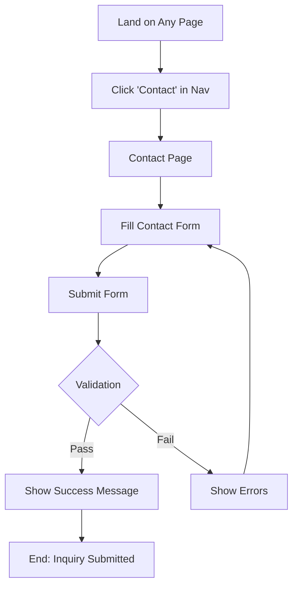

**Steps**:
1. Visitor on any page
2. Clicks "Contact" in navigation
3. Arrives at contact page
4. Fills out contact form
5. Submits form
6. Sees success or error message

**Success Criteria**:
- Form successfully submitted
- Visitor sees confirmation
- Form data preserved on error

### Flow 4: Mobile Navigation

**Goal**: Mobile visitor navigates site

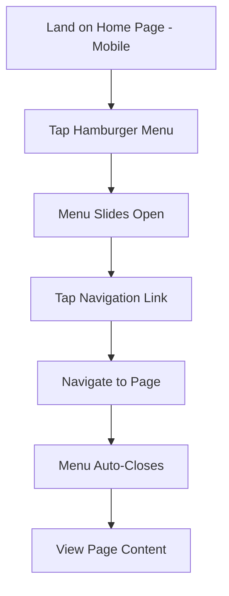

**Steps**:
1. Visitor lands on home page (mobile)
2. Taps hamburger menu icon
3. Menu slides open
4. Taps navigation link
5. Navigates to selected page
6. Menu automatically closes
7. Views page content

**Success Criteria**:
- Menu opens smoothly
- Navigation works correctly
- Menu closes after selection

## Secondary User Flows

### Flow 5: Social Media Discovery

**Goal**: Visitor discovers site via social media

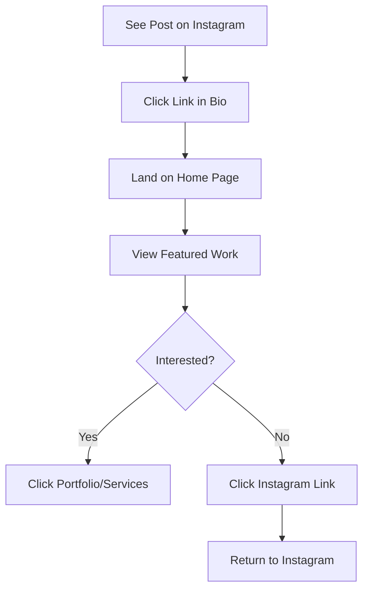

### Flow 6: Search Engine Discovery

**Goal**: Visitor finds site via search

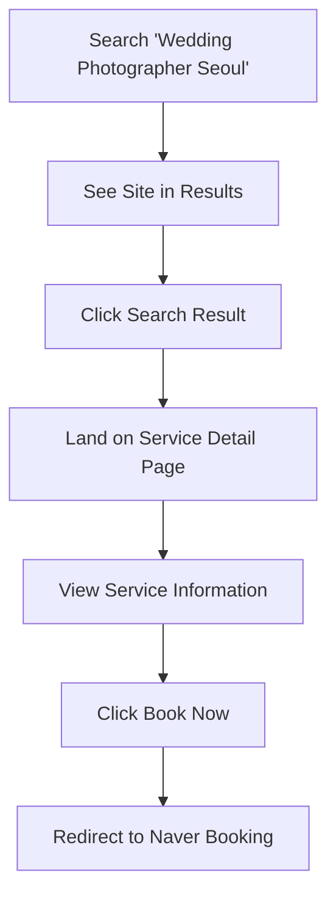

### Flow 7: FAQ Consultation

**Goal**: Visitor seeks information before booking

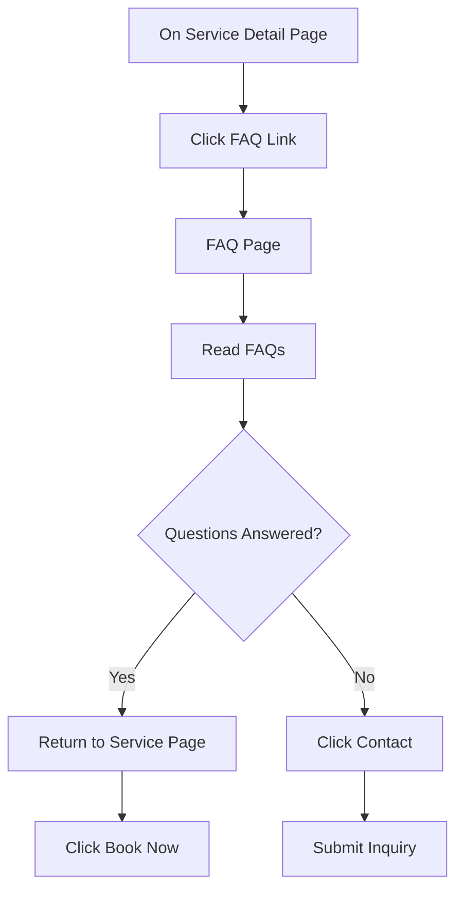

### Flow 8: Portfolio Category Filtering

**Goal**: Visitor finds specific type of work

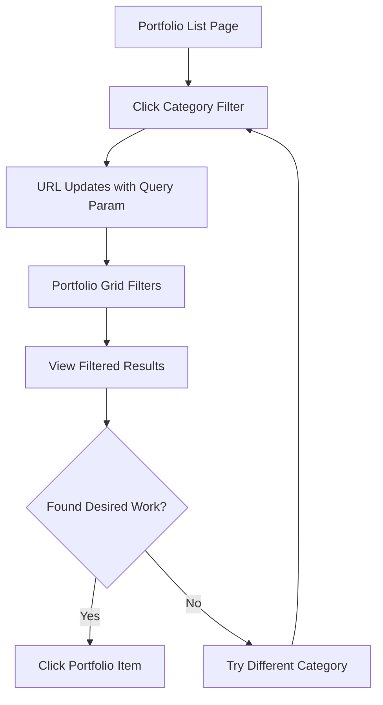

## Error Flows

### Flow 9: Form Validation Error

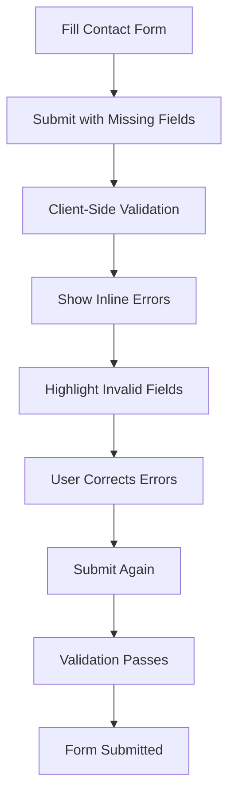

### Flow 10: Network Error

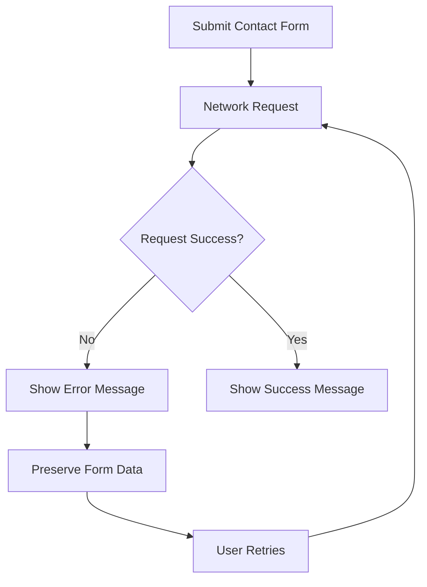

### Flow 11: 404 Error

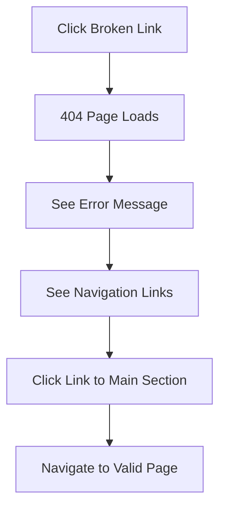

## Conversion Paths

### High-Intent Path (Direct Booking)

```
Home → Services → Service Detail → Book Now (Naver) → Booking Complete
```

**Optimization Points**:
- Clear service CTAs on home page
- Prominent "Book Now" button on service detail
- Sticky booking CTA on mobile
- Booking guidance to reduce friction

### Medium-Intent Path (Portfolio → Inquiry)

```
Home → Portfolio → Portfolio Detail → Contact → Form Submit → Follow-up
```

**Optimization Points**:
- Featured portfolio on home page
- Clear inquiry CTAs on portfolio details
- Simple contact form (minimal fields)
- Immediate confirmation message

### Low-Intent Path (Browse → Social Follow)

```
Home → Portfolio → About → Instagram Link → Follow
```

**Optimization Points**:
- Visible social links in header/footer
- Instagram feed integration (future)
- Consistent brand voice across platforms

## Mobile-Specific Flows

### Mobile Portfolio Browse

```
Home (Mobile) → Hamburger Menu → Portfolio → 
Vertical Scroll → Tap Item → Swipe Gallery → 
Tap Contact CTA → Fill Form → Submit
```

**Mobile Optimizations**:
- Thumb-friendly tap targets (44x44px minimum)
- Vertical scrolling (natural mobile gesture)
- Swipe gestures for image galleries
- Sticky CTAs for easy access
- Auto-close menu after navigation

### Mobile Service Booking

```
Home (Mobile) → Services Card → Service Detail → 
Scroll to Pricing → Tap Sticky Book CTA → 
External Redirect → Naver Booking App
```

**Mobile Optimizations**:
- Sticky booking CTA always visible
- Large, prominent CTA button
- Clear pricing information above fold
- Seamless handoff to Naver app

## Analytics Tracking Points

Each flow includes tracking at key decision points:

1. **Page Views**: Track all page loads
2. **CTA Clicks**: Track all conversion actions
3. **Form Interactions**: Track form starts and completions
4. **External Links**: Track Naver Booking and social clicks
5. **Filter Usage**: Track category filter selections
6. **Error Events**: Track validation and network errors

## Flow Metrics

### Success Metrics

- **Conversion Rate**: % of visitors who click booking CTA
- **Inquiry Rate**: % of visitors who submit contact form
- **Bounce Rate**: % of visitors who leave without interaction
- **Time on Page**: Average time spent on portfolio/service pages
- **Filter Usage**: % of portfolio visitors who use filters

### Performance Metrics

- **Page Load Time**: Time to interactive for each page
- **Form Submission Time**: Time from form start to completion
- **Error Rate**: % of form submissions that fail
- **Mobile vs Desktop**: Conversion rate comparison
